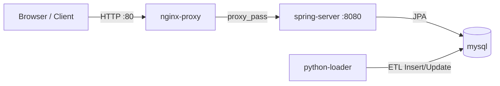
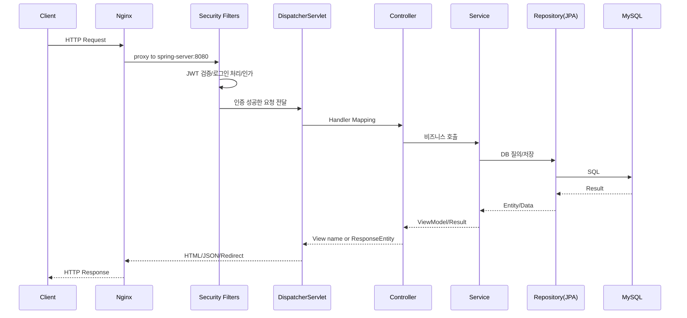

# Tulipmetric 요청-응답 아키텍처 문서

## 1) 전체 시스템 구성 (컨테이너 관점)

`docker-compose.yml` 기준으로 서비스는 아래 4개 컨테이너로 동작합니다.

- **nginx (nginx-proxy)**: 외부 트래픽 진입점(80 포트), 리버스 프록시, rate limit, 보안 헤더 처리
- **spring-server**: 메인 애플리케이션 서버(비즈니스 로직 + SSR + 인증/인가)
- **mysql-container**: 영속 데이터 저장소
- **python-loader**: 데이터 초기 적재/갱신 배치 컨테이너(주식/산업 데이터 수집 후 DB 반영)

---

## 2) 요청-응답 사이클 상세 (클라이언트 요청부터 응답까지)

아래는 사용자가 페이지 요청 또는 API 요청을 보냈을 때의 표준 흐름입니다.

### Step A. 클라이언트 → Nginx

1. 클라이언트가 `http://<host>/...` 로 요청
2. Nginx가 요청 경로별로 정책 적용
    - `/api/` : `api_limit` (10r/s)
    - `/login`, `/api/auth/` : `login_limit` (POST 등 제한)
    - `/login/oauth2/` : OAuth 콜백 완화된 제한
3. 공통 보안 헤더 추가
    - `X-Frame-Options`, `X-Content-Type-Options`, `Referrer-Policy` 등
4. 정적 자원 확장자 요청에는 캐시 정책(`expires 7d`) 적용
5. 최종적으로 `spring-server:8080`으로 프록시 전달

### Step B. Nginx → Spring Security Filter Chain

Spring 서버에 도착한 요청은 먼저 Security 체인을 통과합니다.

1. **`JwtAuthenticationFilter` (매 요청)**
    - 토큰 추출 우선순위:
        1) `Authorization: Bearer <token>`
        2) `ACCESS_TOKEN` 쿠키
    - 토큰 유효 시 `JwtAuthenticationToken` 생성 후 `SecurityContext` 저장
2. **`JwtLoginFilter` (POST `/login`)**
    - `loginid`, `password` 폼 파라미터 인증
    - 성공 시 JWT 발급 후 `ACCESS_TOKEN` HttpOnly 쿠키 저장, `/` 리다이렉트
3. 경로별 인가 정책 확인 (`SecurityConfig`)
    - 공개 페이지: `/`, `/community`, `/industry-detail`, `/login`, `/join` 등
    - 인증/권한 필요: `/mypage`, `/createpost`, `/editcomment` 등
4. OAuth2 로그인 사용 시
    - `CustomOAuth2UserService`가 공급자 정보(google/naver) 표준화
    - 회원 조회/생성 후 인증 성공
    - `OAuth2SuccessHandler`에서 JWT 쿠키 발급 및 `/` 리다이렉트

### Step C. DispatcherServlet → Controller

Security 통과 후 `DispatcherServlet`이 라우팅합니다.

- 예) `GET /` → `IndexController#index`
- 예) `GET /community` → `CommunityController#community`
- 예) `GET /mypage` → `MypageController#mypage`

이때 `@AuthenticationPrincipal Jwt`를 통해 현재 사용자 정보를 바로 주입받아 컨트롤러에서 사용합니다.

### Step D. Service 계층 비즈니스 처리

컨트롤러는 서비스 계층에 위임합니다.

- `IndexServiceImpl`: 시장/기업/즐겨찾기 조회
- `PostService`, `CommentService`, `LikeService`: 커뮤니티 도메인 처리
- `MemberServiceImpl`: 회원 조회, 프로필/비밀번호 변경, 탈퇴

일부 메서드에는 `@LogExecutionTime`가 붙어 AOP(`LogAspect`)로 실행 시간이 로깅됩니다.

### Step E. Repository/JPA → MySQL

서비스는 Spring Data JPA 리포지토리를 통해 MySQL과 통신합니다.

- `MarketRepository`, `CompanyRepoitory`, `PostRepository`, `MemberRepository` 등
- DB 스키마는 `mysql/init.sql` 기반 (`market`, `company`, `member`, `post`, `comment`, `like_entity`, `wishmarket`)

### Step F. 응답 생성 및 반환

- SSR 페이지: Thymeleaf 템플릿 렌더링 후 HTML 응답
- 일부 액션: `ResponseEntity` JSON 또는 리다이렉트 응답
- 응답은 Spring → Nginx → 클라이언트 순으로 반환

---

## 3) 컨테이너별 아키텍처 상세

### 3-1. Nginx 컨테이너

역할 요약:

- **API Gateway 성격의 L7 Reverse Proxy**
- 요청 경로별 트래픽 제어 및 방어선
- Spring 서버의 외부 노출 은닉

주요 구성 포인트 (`nginx/default.conf`):

- `upstream spring_backend { server spring-server:8080; }`
- `limit_req_zone` 기반 요청 제한(로그인/API/OAuth2 분리)
- gzip, 보안 헤더, body size, proxy timeout 설정
- 모든 실질 처리 로직은 Spring으로 위임

의미:

- 애플리케이션 코드 변경 없이 운영 정책(rate limit, header, timeout)을 프록시 레이어에서 조정 가능

### 3-2. Spring 컨테이너 (메인 서버)

역할 요약:

- **시스템의 핵심 오케스트레이터**
- 인증/인가, 도메인 로직, 템플릿 렌더링, DB 트랜잭션 관리

내부 아키텍처 (레이어):

1. **Web Layer**
    - `Controller`
        - `MainService/Index/IndexController`
        - `MainService/Community/Controller/CommunityController`
        - `Mypage/MypageController`
        - `Security/Controller/LoginController`, `JoinController`
2. **Security Layer**
    - `SecurityConfig` 중심
    - `JwtAuthenticationFilter`, `JwtLoginFilter`, `JwtTokenProvider`
    - OAuth2: `CustomOAuth2UserService`, `OAuth2SuccessHandler`
3. **Business Layer**
    - `IndexServiceImpl`, `PostService`, `CommentService`, `LikeService`, `MemberServiceImpl`
4. **Persistence Layer**
    - `domain/**/Repository` (Spring Data JPA)
5. **Cross-cutting Layer**
    - AOP 로깅 (`LogAspect`, `@LogExecutionTime`)

Spring 요청 처리 사이클 (상세):

특히 중요한 점 (메인 서버 관점):

- **Stateless 인증 모델**: 세션 대신 JWT 기반 (`SessionCreationPolicy.STATELESS`)
- **하이브리드 UI/API 처리**: Thymeleaf SSR + 일부 AJAX/REST 엔드포인트 병행
- **권한 정책 중앙화**: URL 단위 인가를 SecurityConfig에서 통합 관리
- **도메인별 서비스 분리**: Index/Community/Mypage/Member로 책임 분리
- **운영 확장성**: Nginx 앞단 정책 + Spring 내부 모듈 구조로 수평 확장에 유리

### 3-3. Python 컨테이너 (`python-loader`)

역할 요약:

- **데이터 수집/가공 ETL 배치**
- 공공 API(data.go.kr, KOSIS)에서 업종/종목 지표 수집
- 업종별 차트·성장률 등 계산 후 MySQL `market`, `company` 데이터 반영

동작 특징:

- `python/Sql_Insert_API.py` 실행
- `.env` 기반 DB/API 키 주입
- `depends_on: mysql (healthy)` 이후 기동
- 서비스 지속 실행형이 아니라 초기 적재 작업 성격 (`restart: "no"`)

### 3-4. MySQL 컨테이너

역할 요약:

- 서비스 영속 데이터 저장
- 초기 스키마 부팅 시 `mysql/init.sql` 자동 반영

핵심 테이블:

- 인증/회원: `member`
- 메인 데이터: `market`, `company`
- 커뮤니티: `post`, `comment`, `like_entity`
- 개인화: `wishmarket`

---

## 4) 요청 유형별 실제 사이클 예시

### 4-1. 비로그인 사용자 메인 페이지 조회 (`GET /`)

1. Client → Nginx (`/`)
2. Nginx → Spring
3. JWT 없으므로 비인증 컨텍스트
4. `IndexController#index` 진입
5. `IndexServiceImpl.findAllMarkets()` 조회
6. Thymeleaf `MainService/index` 렌더링
7. HTML 응답 반환

### 4-2. 로그인 처리 (`POST /login`)

1. Client가 `loginid/password` 전송
2. Nginx 로그인 rate limit 적용
3. `JwtLoginFilter` 인증 시도
4. 성공 시 JWT 생성 후 `ACCESS_TOKEN` 쿠키 저장
5. `/` 리다이렉트 응답

### 4-3. 인증 필요 페이지 (`GET /mypage`)

1. 쿠키의 `ACCESS_TOKEN` 전달
2. `JwtAuthenticationFilter`가 토큰 검증 후 `SecurityContext` 설정
3. 인가 정책에서 `/mypage` 접근 허용(ROLE_USER/ROLE_LOOT)
4. `MypageController`가 회원/활동 데이터 집계
5. `Mypage/mypage` 템플릿 반환

---

## 5) 한 줄 정리

- **Nginx**는 “입구 제어(프록시/보안/트래픽 정책)”를 담당하고,
- **Spring**은 “인증·인가 + 비즈니스 + 화면/응답 생성”을 담당하는 메인 서버이며,
- **Python**은 “시장 데이터 ETL 적재”를 담당하고,
- **MySQL**은 “도메인 데이터 영속화”를 담당합니다.

즉, Tulipmetric의 요청-응답 아키텍처는 **Nginx(경계) → Spring(핵심 처리) → MySQL(저장소)**의 온라인 경로에, **Python(오프라인 데이터 공급)**이 결합된 구조입니다.
